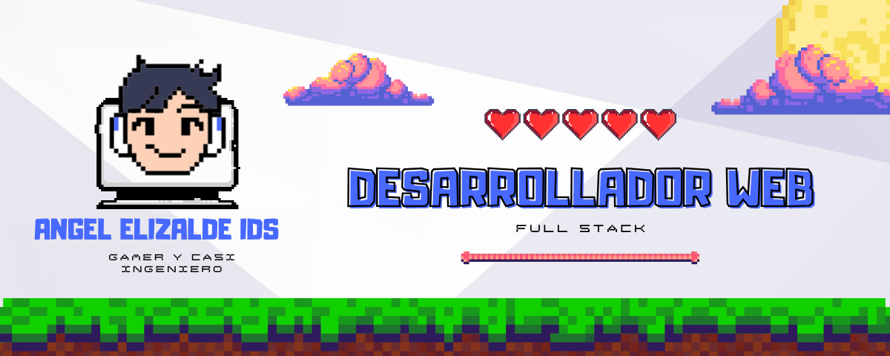

#  Bienvenid@ Al GitHub De Angel Elizalde (Anzalket)

👋 Hola a todos!
Soy Angel Uriel Elizalde Lopez, estudiante de Ingeniería en Desarrollo de Software. Actualmente curso el tercer semestre y una de mis mayores pasiones es la programación web. Me encanta explorar nuevas tecnologías y aplicar mis conocimientos para crear soluciones innovadoras. 🚀

### Skills

